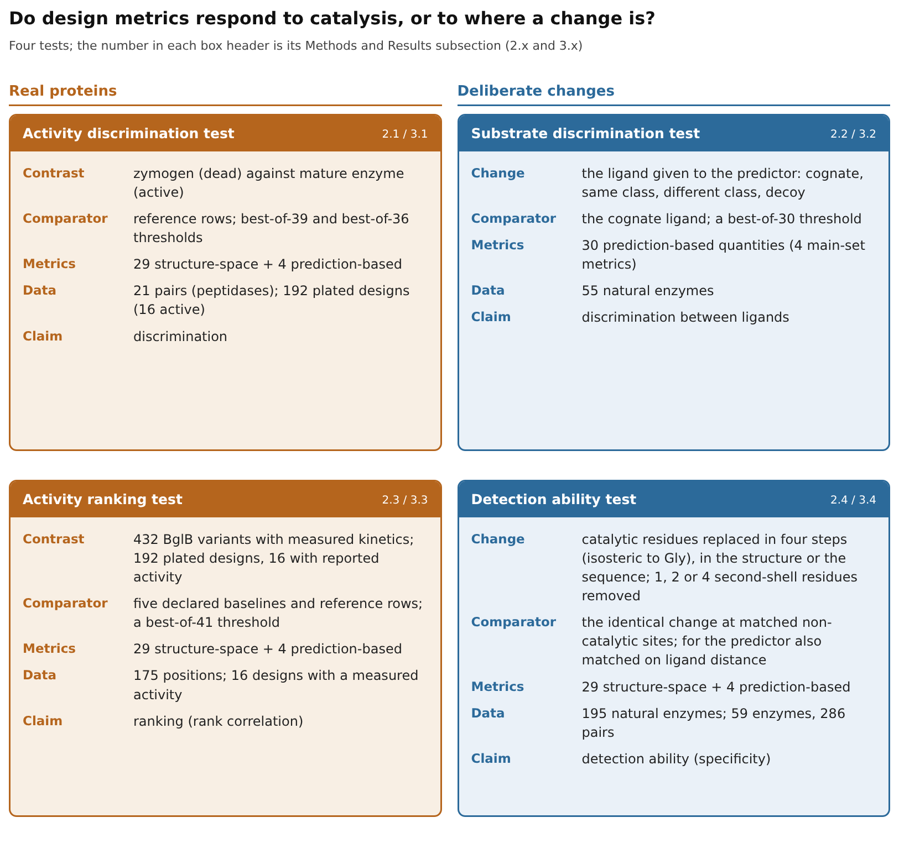

# 2 Methods

**How this section is organised.** Section 2 has four subsections that correspond one to one to those of the Results, down to the sub-subsections (2.1 → 3.1, 2.2 → 3.2, 2.3 → 3.3, 2.4 → 3.4; 2.1.1 → 3.1.1, and so on): the activity discrimination test (2.1), the substrate discrimination test (2.2), the activity ranking test (2.3) and the detection ability test (2.4). Each describes the **experiment**, the **dataset** (cases, selection, why it was chosen), the **metrics scored**, the **ranking criteria** with their equations, and the **limits**. Before 2.1 come the study map (Figure 1, Tables 1 and 2), the terms (Box 1), the metrics (Box 2) and the notation (Box 3). Two tests use real proteins as they are (2.1, 2.3); two introduce a deliberate change (2.2, 2.4). Numbers in square brackets are references (list at the end). Tables with an S number are supplementary tables: each is described in the separate Supplementary PDF and released as a CSV file (`main/` and `supplementary/`).

## The study at a glance

We ask one question: **do the in-silico metrics used to filter designed enzymes respond to catalysis, or to something simpler, such as how close a change is to the active site?** A metric that detects catalysis should move more when a catalytic residue is damaged than when the same damage is made elsewhere in the same protein. Figure 1 shows how the study tests this, in four tests.

**Figure 1. The study map.** The four tests, what is changed or contrasted in each, what the metric is compared with, which metrics are used, and which claim the test supports. Numbers are taken from Tables 1 and 2. <!-- src: tables/main/T1_study_map.csv; tables/main/T2_datasets.csv -->

The four tests support three kinds of claim:

- **Discrimination** (2.1 and 2.2). Does a metric differ between two states that should differ? In 2.1 the states are a catalytically dead enzyme and its active form (real structures); in 2.2 they are the cognate ligand and a wrong ligand given to a structure predictor. We compare each state with the other and, in 2.1, with reference rows that need no catalytic information.
- **Ranking** (2.3). Does a metric track measured activity? We compare metric values with measured kinetics and with declared trivial baselines.
- **Detection ability** (2.4). Does a metric respond more to damage at a catalytic residue than to the identical damage at a matched non-catalytic site of the same protein? We damage the protein on purpose and compare the two responses.

Two kinds of metric are tested. **Structure-space metrics** read atomic coordinates; they are tested in 2.1, 2.3 and 2.4. **Prediction-based metrics** read the output of a structure predictor that is given a sequence and a ligand; they are tested in 2.2 and 2.4, and again in 2.1 and 2.3. The metrics valid and tested in all four tests are the ones this paper reports (Box 2).

**Table 1. The experiments in detail.** Each row is one experiment: the Results subsection that reports it, what is changed or contrasted, what the metric is compared with, which metrics are scored, and how many units there are. <!-- src: tables/main/T1_study_map.csv -->

<!-- cols: 1.45,2.2,3.0,2.6,1.6,1.7 -->
| Results | Experiment | What is changed or contrasted | Compared with | Metrics | Units |
|---|---|---|---|---|---|
| 3.1 | Zymogen versus mature enzyme, evaluation set | real dead and active forms | reference rows and a best-of-39 threshold | 29 structure-space | 21 pairs |
| 3.1 | Same 21 pairs, re-predicted | predictions of the dead and active forms | the same | 4 prediction-based | 21 pairs |
| 3.1 | Plated designs, evaluation set | 192 designs: 16 active, 176 no active | reference rows and a best-of-36 threshold | 29 structure-space and 2 prediction-based | 192 designs |
| 3.2 | Substrate swap, evaluation set | the ligand given to the predictor: cognate, same class, different class, decoy | the cognate ligand; a best-of-30 threshold | 30 prediction-based quantities (4 main-set metrics, see 2.2) | 55 enzymes |
| 3.3 | BglB variants, evaluation set | real substitutions with measured kinetics | five declared baselines, reference rows and a best-of-41 threshold | 29 structure-space (28 defined) | 432 variants at 175 positions |
| 3.3 | BglB variants, re-predicted | predictions of the variants | the same | 4 prediction-based | same |
| 3.3 | Plated designs, evaluation set | 192 designs, 16 with measured activity | reference rows | 29 structure-space and 2 prediction-based | 16 designs with a measured activity |
| 3.4 | Catalytic lesion, in structures | catalytic residues replaced in four steps: isosteric, non-isosteric, to Ala, to Gly | the identical substitution at matched non-catalytic sites; a best-of-33 threshold | 29 structure-space | 195 enzymes (143 main + 52 pilot) |
| 3.4 | Second-shell lesion, in structures | 1, 2 or 4 second-shell residues removed | matched control | same 29 | up to 193 enzymes |
| 3.4 | Detection floor | all catalytic residues replaced by Gly (the same lesion as the Gly step) | the untouched structure, put through the same treatment | same 29 | 143 enzymes |
| 3.4 | Catalytic lesion, re-predicted | one catalytic residue substituted per prediction | matched control, then a distance-matched control, then a regression adjustment | 4 prediction-based | 59 enzymes, 286 pairs |

**Table 2. Datasets.** Which data each Results subsection uses, and what the labels are. <!-- src: tables/main/T2_datasets.csv -->

<!-- cols: 2.2,1.8,3.6,2.4,2.7 -->
| Dataset | Used in | Composition | Labels | Notes |
|---|---|---|---|---|
| Zymogen–mature pairs, evaluation set | 3.1 | 21 pairs from 21 proteins (9 serine, 8 cysteine, 4 aspartic peptidases); the two forms share a ligand; both re-predicted with Chai-1 | dead (zymogen) or active (mature) | subset of the 49-pair wider set and of the 28 re-predicted pairs |
| Zymogen–mature pairs, wider set | 3.1 (Supplement) | 49 pairs scored (55 candidates); structure-space metrics only; 28 of them re-predicted | as above | trapping-mutant pairs were examined and retired |
| Substrate-swap enzymes, evaluation set | 3.2 | 55 M-CSA enzymes, stratified by enzyme class (of 59; 4 excluded because a supplied ligand is missing from a prediction) | none | 28 of the 59 are also in the 143-enzyme set; the 30 de novo designs are in S1 |
| BglB variants | 3.3 | β-glucosidase B: 655 single-point variants at 207 positions; 432 analysed at 175 positions | log10 kcat/KM relative to wild type: 166 impaired, 254 wild-type-like | one enzyme; variant-level data are not redistributed |
| Plated designs | 3.1, 3.3 | 192 designs on two 96-well plates, in 136 backbone clusters | 16 with measured kcat/KM (active); 176 no active (not confirmed inactive) | 10 of the 16 active designs lie in two backbone clusters |
| 143-enzyme set | 3.4 | enzymes from the Mechanism and Catalytic Site Atlas (M-CSA), 77 enzyme sub-subclasses, median 6 catalytic residues; 2 carry a bound ligand | none | the primary set; pooled with the pilot set in each lesion test (Results 3.4) |
| Shortened-motif set | 3.4 (sensitivity) | the same 143 enzymes with at most 3 catalytic residues kept | none | tests whether motif size matters |
| Pilot set | 3.4 (pooled with the 143 enzymes) | 53 enzymes (annotation from UniProt active sites and M-CSA, mixed; 35 peptidases; 34 with a ligand) | none | not a subset of the 143-enzyme set; shares one PDB entry, so 52 are added to the 143 in both lesion tests; looser controls |
| Curated designs | 3.4 (sensitivity), 3.2 (S1) | 30 de novo metallohydrolase designs with a three-histidine zinc site; transition-state analogue supplied | 16 active, 3 inactive, others unlabelled | 23 of the 30 are on the plates |
| Ladder pairs | 3.4 | 74 systems (59 natural, 15 designs); 312 catalytic/control pairs, of which the 286 natural pairs are analysed in Table 8 | none | one residue per prediction |

> **Box 1 — Terms used throughout.** **Lesion**: a deliberate change to a protein (a substitution, a removal, or a swap of the ligand given to a predictor). **Response (Δ)**: how much a metric changes because of a lesion, measured against the same protein put through the same treatment without it. **Matched control**: the identical lesion applied at a non-catalytic site of the same protein, matched on residue type and burial (and, where stated, packing, secondary structure and distance to the ligand). **Specificity ratio (SR)**: the response at the catalytic site divided by the response at the control; SR = 1 means the metric cannot tell the two apart (2.4). **Discrimination (AUROC)**: the probability that a randomly chosen member of one class scores higher than a member of the other, where 0.5 means no discrimination; we report the direction-free form max(A, 1 − A), which cannot fall below 0.5 (equations in 2.1). **Ranking**: whether a metric orders designs or variants by measured activity (Spearman ρ, equations in 2.3, or expected hits per plate). **Rank statistic R**: the probability that a metric changes more at the catalytic lesion than at the matched control (equations in 2.4). **Reference row or baseline**: a quantity that needs no catalytic information (resolution, sequence length, tyrosine fraction, the distance to the catalytic residues) which any useful metric must beat.

**Box 2 — The 33 reported metrics and the reference rows.** In a structure, "perturbed residues" are the residues that were changed; in the control arm they are the control residues, so a site-scoped metric never knows which residues are catalytic — it only knows which residues it was handed. In 2.1 and 2.3 the scored residues are the catalytic residues. The third column says where each definition comes from. <!-- src: tables/audit/A5_main_metric_set.csv; src/mrx/perturb/engine.py scoring_scope; src/mrx/metrics/_runners/rosetta_run.py; src/mrx/metrics/environment.py; src/mrx/metrics/_runners/propka_run.py -->

<!-- cols: 2.0,4.0,4.4,2.0 -->
| Group | Metrics | Reads, and where it is defined | Scored over |
|---|---|---|---|
| Rosetta energy, site-scoped (15) | attraction, repulsion, intra-residue repulsion, solvation, lk-ball solvation, electrostatics, hydrogen bonds (backbone–side-chain, side-chain–side-chain), rotamer (Dunbrack), Ramachandran, amino-acid propensity, omega torsion, net van der Waals (repulsion plus attraction), site total, worst single residue | coordinates; the per-residue terms of the REF2015 energy function [1] computed with PyRosetta [2] and summed over the scored residues (site total: the sum of the residue totals; worst residue: the largest residue total) | the perturbed residues |
| Catalytic geometry (8) | fraction buried, relative solvent-accessible area (mean, max), total solvent-accessible area, pairwise distance (mean, max), radius of gyration, polar contacts | coordinates; SASA by the Lee–Richards algorithm [3] in FreeSASA [4] (probe 1.4 Å, waters excluded), relative to the maximum accessibility of the residue type [5]; fraction buried is the share of the scored residues with relative SASA below 0.10; distances and radius of gyration are over all pairs, or all atoms, of the side-chain heavy atoms of the scored residues (backbone atoms for Gly); a polar contact is a pair of polar side-chain atoms of two scored residues within 3.5 Å | the perturbed residues |
| Catalytic pKa (6) | PROPKA pKa (min, max, mean, range) and pKa shift (mean, max absolute) | coordinates; PROPKA3 [6, 7] pKa of the scored ionisable residues; the shift is the pKa minus the pKa of the model compound | the perturbed residues |
| Interface confidence (2) | ipTM; per-chain pTM minimum | predictor output of Chai-1 [8]; ipTM as introduced for AlphaFold-Multimer [9]; the pTM of each chain, from the TM-score head of AlphaFold [10] | the protein–ligand interface |
| Active-site accuracy (2) | AME RMSD (catalytic-atom RMSD to a reference structure after backbone superposition, best of the predicted models); ligand clearance (closest approach of the ligand to the backbone, best of the models) | predictor output and a reference structure; the criteria of the Atomic Motif Enzyme benchmark of RFdiffusion2 [11], as implemented in this project (equations in 2.2) | the catalytic atoms; the ligand |
| Reference rows (6; never counted as metrics under test) | resolution, sequence length, net charge, tyrosine fraction, pLDDT, pTM | deposit, sequence or predictor; net charge is (K + R) − (D + E) counted in the sequence; pLDDT and pTM from AlphaFold [10] | whole protein |

**Which metrics are reported.** The panel contains 216 named quantities, which collapse to 191 distinct metrics once literal aliases are merged; 63 of them are bookkeeping counters and constants on which no test can be run. Whether a metric can be tested in a given experiment is decided from three things only — what the metric reads, whether it is defined under the experimental condition, and the design of the experiment — never from the result. A metric with no residue-set input (whole-protein energies, sequence composition, whole-prediction confidence) cannot respond *specifically* to catalytic residues, and a metric whose input cannot reach the perturbed quantity cannot register the lesion at all (sequence composition under a rotamer change, for example). Such metrics are kept as comparators in the Supplement. One further quantity is kept out of the main set although it passes these tests: the Chai-1 combined score, which Chai-1 uses to rank its own models and which equals $0.2\,\mathrm{pTM} + 0.8\,\mathrm{ipTM} - 100 \times (\text{inter-chain clash flag})$ (from the Chai-1 code), so that it is a rescaled ipTM and not an independent metric (it is still scored, and its results are in the Supplement). The main text reports the **33 metrics that are valid and tested in all four tests** (Box 2), so that one set of metrics runs through the whole paper, plus six reference rows chosen before any result was seen. The role of each of the 191 distinct metrics (main, reference, supplement or excluded) and the reason for it are in Table S2; what each of the 216 named quantities reads, and over which residues it is scored, is in Table S3; whether each can be tested in each of the 30 tests, and if not why, is in Tables S4 (one row per metric and test) and S5 (counts by class of metric); the counts of the earlier whole-panel analysis restated on the eligible metrics only are in Table S6; and the list of the tests, with comparator, control type and role, is in Table S7. <!-- src: tables/audit/A5_main_metric_set.csv (33 main, 6 reference, 63 bookkeeping, 1 derived of 191 keys); tables/audit/A1_metric_contracts.csv (216 names); tables/RULES.md; tables/rules.json -->

**Box 3 — Notation of the equations.** Every table of the Results ranks a set of *items* (the metrics, the reference rows and, in 2.3, the declared baselines). $m$ is an item and $M$ the number of items ranked in one table; $x_u(m)$ is the value of item $m$ on unit $u$ (a structure, a prediction, a variant or a design). $N_{\mathrm{boot}} = 5{,}000$ is the number of bootstrap draws and $N_{\mathrm{perm}} = 5{,}000$ the number of permutations, unless a different number is stated; $q_{\alpha}$ is the $\alpha$-quantile of a set of values. $\mathbf{1}(\cdot)$ is 1 if its argument is true and 0 otherwise. In 2.1 and 2.2, $A_m$ is the AUROC of item $m$ and $A^{*}_m$ its direction-free form; in 2.3, $\rho_m$ is the Spearman correlation and $I_v$ the measured impairment of variant $v$; in 2.4, $\Delta$ is the response to a lesion, $R_{m,s}$ the rank statistic of item $m$ at step $s$ and $\bar R_m$ its mean over the counted steps. $T^{(r)}$ is the largest statistic among the $M$ items in permutation $r$ (the max-statistic of 2.1), and $q_{0.95}(T)$ is the best-of-$M$ threshold.

---

## 2.1 Activity discrimination test: do the metrics separate a dead enzyme from an active one? → Results 3.1

**Experiment.** Every metric is scored on real proteins in which one state is catalytically dead and the other active, and the metrics are ranked by how well their values separate the two states. Two datasets are used, each with its own table and its own n: 21 zymogen–mature pairs (2.1.1, Table 3) and 192 plated designs, of which 16 are active (2.1.2, Table 4). The procedure is the same for both:

1. assemble the structures and label each one (dead or active; active or no active);
2. compute every item on every structure: the structure-space metrics on the deposited coordinates, the prediction-based metrics on a Chai-1 [8] prediction of the structure together with its ligand;
3. compute the AUROC of every item and a bootstrap interval that resamples the clustering unit;
4. rank the items by the direction-free AUROC and compare the top of the ranking with the best-of-$M$ permutation threshold.

**Illustration.** A zymogen is an inactive precursor that already contains the catalytic residues of the mature enzyme. A metric that detected catalytic competence would separate the two structures; a metric that only reads the geometry of the catalytic residues would not, because that geometry is almost the same in both.

### 2.1.1 Discriminate natural active and dead enzymes → Results 3.1.1

**Dataset.** Pairs of structures of the same protein, the zymogen (dead) and the mature enzyme (active). The structures were downloaded from the RCSB Protein Data Bank [12, 13]; the proteins and the propeptide boundaries come from UniProt [14]. The pairs were assembled in four steps, and the evaluation set is the last:

<!-- cols: 2.4,3.6,5.2 -->
| Step | Cases | Rule |
|---|---|---|
| UniProt discovery | reviewed proteins of EC 3.4.* with a propeptide feature and PDB structures | a protein is shortlisted when its PDB chain ranges give both a candidate zymogen and a candidate mature X-ray entry |
| Shortlisted proteins | 100 | the proteins that pass the rule above |
| PDB entities classified | 5,717 (1,182 zymogen, 4,528 mature, 7 indeterminate) | each entity is called zymogen or mature from its SIFTS [15] alignment to the UniProt chain and propeptide boundaries, never from the entry title |
| Candidate pairs | 55 pairs of 55 proteins | one zymogen and one mature entity per protein; both X-ray, no engineered mutation, resolution at most 2.5 Å |
| Scored pairs (wider set) | 49 | structure-space metrics scored on both forms (S8); trapping-mutant pairs were examined and retired |
| Re-predicted pairs | 28 | both forms predicted with Chai-1, three seeds each (S9) |
| **Evaluation set** | **21** | the two forms share a ligand; the 7 apo pairs are excluded |

The 21 pairs are 21 proteins, all peptidases (9 serine, 8 cysteine and 4 aspartic; EC 3.4.21, 3.4.22, 3.4.23), with shared ligands such as inhibitors and metal ions. In the wider set of 49 pairs the median catalytic-constellation RMSD between the two forms is 0.207 Å (0.484 Å after backbone superposition), so the chemistry of the site is intact in the dead form. The definitions of the six pair sets used in 3.1 (55, 49, 45, 28, 21 and 96 pairs) and the table that uses each are in Table S10. <!-- src: results/P0/zymogen_candidates.csv; results/P0/zymogen_pairs.csv; ops/p0_zymogen_pairs.py (MAX_RES 2.5); tables/supp/S17b_pair_set_definitions.csv; results/P5/t2_systems.csv; tables/spec/derived/zymogen21_meta.json; results/P0/REPORT.md (median RMSD table) -->

**Why this dataset.** A zymogen and its mature enzyme hold the catalytic residues constant while the enzyme is dead in one form and active in the other, so they are a *real* negative: the labels are correct by definition. They answer the objection that a metric may only recognise synthetic negatives. The 21-pair subset is the evaluation set because it is the only one on which every main-set metric, structure-space and prediction-based, and every reference row has a value on both forms of every pair, so that one n applies to every row of Table 3. The pairs were selected by ligand sharing and not by any metric value; the choice was made after the 49-pair and 28-pair analyses had been read, and those analyses are in the Supplement (S8, S9). A second class of dead enzymes, substrate-trapping mutants, was verified against the primary literature (26 of 30 were not confirmed dead) and retired (S11). <!-- src: results/P5/t2_systems.csv; tables/supp/S19_trapping_verification.csv; PREREG.md section 10 -->

**Metrics scored.** The 33 main-set metrics (Box 2) and the 6 reference rows, 39 items in all, are computed on both forms of each pair. The 29 structure-space metrics are computed on the deposited coordinates over the catalytic residues, taken from M-CSA [16] and UniProt [14] annotation. For the 4 prediction-based metrics both forms of each pair were re-predicted with Chai-1 together with the shared ligand (three seeds, averaged), and active-site accuracy is measured against each form's own deposited structure. Table S12 lists every metric scored on the 21 pairs (158, including whole-protein, sequence-only and PLACER [17] comparators). The reference rows are reported in full, with intervals, for every activity test in Table S13.

**Ranking criteria.** Let $P$ be the dead forms and $Q$ the active forms, $|P| = |Q| = n = 21$. The AUROC of item $m$ is the probability that a randomly chosen dead form has a larger value than a randomly chosen active form, ties counting one half [18]:

$$A_m \;=\; \frac{1}{|P|\,|Q|}\sum_{p \in P}\sum_{q \in Q}\Big[\,\mathbf{1}\big(x_p(m) > x_q(m)\big) + \tfrac{1}{2}\,\mathbf{1}\big(x_p(m) = x_q(m)\big)\Big] \tag{1}$$

This equals the Mann–Whitney statistic $U$ divided by $|P|\,|Q|$ [19]. $A_m = 0.5$ means that the item does not separate the two forms, $A_m = 1$ that every dead form is above every active form and $A_m = 0$ that every dead form is below every active form. We ask whether an item separates the forms, not in which direction, so items are ranked by

$$A^{*}_m \;=\; \max\!\big(A_m,\; 1 - A_m\big) \;\ge\; 0.5 , \tag{2}$$

and the directed $A_m$ is kept so that the direction is visible ("higher in" in Table 3 is the form in which the item takes larger values: dead if $A_m > 0.5$). Because $A^{*}_m$ cannot fall below 0.5, the lower end of its interval is close to 0.5 for almost every item and is not informative by itself.

The interval is a percentile bootstrap that resamples **pairs** with replacement, so that both forms of a drawn pair enter together [20, 21]. With $b = 1,\dots,N_{\mathrm{boot}}$ draws (5,000, seed 20260806), $A^{*(b)}_m$ is recomputed on each resampled set and

$$\Big[\,q_{0.025}\big(A^{*(1)}_m,\dots,A^{*(N_{\mathrm{boot}})}_m\big),\;\; q_{0.975}\big(A^{*(1)}_m,\dots,A^{*(N_{\mathrm{boot}})}_m\big)\Big] \tag{3}$$

is the 95% interval. A pair is also a protein, so the design-level and the cluster-level N are both 21.

Table 3 ranks $M = 39$ items, and the top of such a ranking looks good by chance. To say how good, the labels are permuted. Within a pair the two forms are exchangeable if the item is unrelated to the label, so in replicate $r = 1,\dots,N_{\mathrm{perm}}$ we draw $s_i^{(r)} \sim \mathrm{Bernoulli}(1/2)$ for every pair $i$, swap the dead and active labels of the pair when $s_i^{(r)} = 1$, and recompute $A^{*(r)}_m$ for every item. The same swaps serve all items, which keeps the correlation between metrics. The largest value over the items in each replicate,

$$T^{(r)} \;=\; \max_{m = 1,\dots,M} A^{*(r)}_{m}, \tag{4}$$

has the distribution of the best AUROC of $M$ unrelated items. Its median and its 95th percentile $q_{0.95}(T)$ are the **best-of-39 threshold** (median 0.63, 95th percentile 0.68): an observed $A^{*}_m$ above it is higher than the best of 39 unrelated items in 95% of simulations. Taking the maximum over items is the max-statistic form of permutation control of multiple comparisons [22]. The threshold is a reference level for reading the ranking. For the complete table of all 158 metrics (S12) the same procedure gives the best-of-158 threshold. In Table 3 the AUROCs above the threshold are in bold. No threshold is adopted for this set: we report whether any main-set metric exceeds the best-of-39 threshold, and no point estimate is offered as a headline when its interval is wider than 0.2. <!-- src: ops/zymogen21_auroc.py; tables/spec/derived/zymogen21_meta.json (selection_null_max_p50, selection_null_max_p95) -->

**Limits.**
- 21 pairs is a small set, and the interval of any single AUROC is wide (the best-of-39 threshold has a median of 0.63).
- All 21 proteins are peptidases whose zymogen-to-enzyme activation is a well-characterised event; the set says nothing about other enzyme classes.
- The pairs share a ligand by construction, so they are more likely to have a ligand-bound mature structure than a typical deposit.
- A zymogen construct carries a propeptide, so the dead form is on average longer and its predicted confidence lower; protein-level quantities can separate the forms without reading catalysis.
- The same-state null and the confound floor of the earlier analysis were computed for the 49 pairs and are not restated on 21; the reference rows on the same pairs take their place (the AUROC of every metric against the same-state null on the 49 pairs is in Table S8).

### 2.1.2 Discriminate de novo designed active and no active enzymes → Results 3.1.2

**Dataset.** A deposited metallohydrolase design campaign [23]: 192 designs on two 96-well plates (two campaigns of 96 designs, the two 96-design zinc campaigns that are also reported with RFdiffusion2 [11]). Of the 192, **16 have a reported kcat/KM** (*active*) and **176 are no active**. The designs lie in **136 backbone clusters**, and the 16 active designs lie in 8 of them (5 in each of two clusters and one in each of six others). The catalytic motif is the three histidines that coordinate the zinc, derived geometrically and checked against 23 curated annotations (23 of 23 agree). For the predictions the ligand is the design's transition-state analogue together with the zinc. One set serves every row of Table 4: every item is scored on all 192 designs. <!-- src: data/systems/p6_d3_v1/systems.csv; results/P6_m3/enrichment_summary.json; tables/spec/derived/plates192_meta.json -->

**Why this dataset.** These are the deposited de novo enzyme designs for which models and measured activity are both available, so they let the metrics be tested on designs and not only on natural enzymes. A design absent from the table of characterised hits was not reported as active, and the comparison is active against no active. The plate analyses were planned as descriptive, without an AUROC, before the data were analysed; the descriptive analyses (rank correlation among the 16, hits per plate) are reported in 2.3.2 and the AUROC, added later, in this subsection. <!-- src: PREREG.md section 13; RESEARCH_PLAN.md section 6.4 -->

**Metrics scored.** The 36 items are the 29 structure-space main-set metrics, the two prediction-based main-set metrics that the plates define (ipTM and the per-chain pTM minimum) and five reference rows (tyrosine fraction, net charge, sequence length, pLDDT and pTM; designs have no crystallographic resolution). An item must have a value on at least 80% of the designs. The AME RMSD and the ligand clearance are measured on the plates against each design's own model, which is a different metric from AME against a deposited structure (the two flavours are never pooled), so they are in the Supplement and not among the ranked items. Table S14 lists every metric scored on the designs (128).

**Ranking criteria.** The statistic is Eq. (1) and (2) with $P$ the 16 active designs and $Q$ the 176 no active designs, over the 192 designs; "higher in" in Table 4 is the group in which the item takes larger values. The interval resamples the $G = 136$ **backbone clusters** with replacement, all designs of a drawn cluster entering together, so that designs built on one backbone are not counted as independent (5,000 draws, seed 20260807; a draw with no active design has no AUROC and is dropped):

$$\Big[\,q_{0.025}\big(A^{*(b)}_m\big),\;\; q_{0.975}\big(A^{*(b)}_m\big)\Big], \qquad A^{*(b)}_m = \max\!\big(A^{(b)}_m,\, 1 - A^{(b)}_m\big), \tag{5}$$

with $A^{(b)}_m$ from Eq. (1) on the designs of the drawn clusters. The design-level N is 192 and the cluster-level N is 136, with 16 actives in 8 clusters. The chance reference is the permutation of Eq. (4) with the activity labels permuted among the 192 designs instead of swapped within pairs, $M = 36$ items and 5,000 permutations: the **best-of-36 threshold** (median 0.66, 95th percentile 0.73), and the best-of-128 threshold (0.75) for the 128 metrics of Table S14. Because 10 of the 16 active designs lie in two backbone clusters, designs are not exchangeable and the threshold understates the chance range. Table 4 marks the AUROCs above the best-of-36 threshold in bold. <!-- src: ops/plates192_auroc.py; tables/spec/derived/plates192_meta.json -->

**Limits.**
- The 176 no active designs are not confirmed inactive, so the AUROC compares active designs with the rest of the plate.
- Ten of the 16 active designs lie in two backbone clusters, so the effective number of independent actives is small, the intervals are wide and the best-of-36 threshold understates the chance range.
- The designs differ in length and size; sequence length is a reference row.

---

## 2.2 Substrate discrimination test: do prediction-based metrics know which ligand they were given? → Results 3.2

**Experiment.** A structure predictor (Chai-1 [8]) is given a protein together with its own substrate, and then together with a wrong one, and the prediction-based quantities are ranked by how well they separate the cognate prediction from a wrong-ligand prediction of the same enzyme. Chai-1 is run on the sequence, the ligand (as a chemical structure) and, where relevant, the catalytic metal, with default settings and a fixed seed; each prediction yields five models and their confidence scores. Only the ligand supplied changes. The protein is untouched, and four conditions are built for every enzyme:

1. **cognate**: the substrate of the enzyme (three seeds, 101, 202 and 303; the cognate condition has two further seeds that serve as the noise floor and are not used in the evaluation);
2. **same class**: a different substrate of an enzyme of the same enzyme class;
3. **different class**: a substrate of an enzyme of a different class;
4. **decoy**: a ligand taken from an unrelated structure.

Wrong ligands have three seeds each, and the catalytic metal is kept in every condition. The apo condition (no ligand) is excluded for interface and ligand-dependent terms, because without a ligand there is no interface to be confident about. <!-- src: results/P5/scores_m3.csv; tables/spec/derived/swap55_meta.json -->

**Illustration.** Chai-1 predicts a hydrolase together with its own substrate, and again together with a substrate of a different enzyme class. If ipTM falls when the wrong substrate is given, the metric "knows" which substrate belongs to the protein; the AUROC measures how reliably it does.

**Dataset.** Natural enzymes of M-CSA [16] with a bound cognate ligand: 59 enzymes enter the experiment, and the **evaluation set is the 55 natural enzymes** on which every scored quantity has a defined value in the cognate condition and in all three wrong-ligand conditions, and on which every ligand that was supplied was present in the prediction. The four exclusions are enzymes whose cognate or wrong ligand contains a heme-type group that cannot be built into a chemical structure, so the predictor drops it and the prediction is effectively apo for that cell. The rule is about the availability of values and not about any result. The experiment is balanced: seeds 101, 202 and 303 in every condition. Twenty-eight of the 59 enzymes are also in the 143-enzyme set of 2.4. <!-- src: results/P5_1B/s_axis_dropped_cells.csv; tables/spec/derived/swap55_meta.json -->

**Why this dataset.** A wrong ligand can only be defined for an enzyme whose substrate is known, and the M-CSA entries with the cognate reaction ligand present (150 of 434) are the natural enzymes for which this holds. Natural enzymes carry the main analysis because their active-site accuracy is measured against the deposited structure; the 30 de novo designs, whose active-site accuracy is measured against the design's own model and is never pooled with it, are in S1. The choice of the 55 systems was made after the earlier all-system analysis had been read. <!-- src: data/raw/mcsa_dataset_v1/PROVENANCE.md; PREREG.md section 11 -->

**Metrics scored.** Every prediction is scored on 33 prediction-based quantities, of which Table 5 ranks 30. The three summaries of the Chai-1 combined score are scored but not listed, because the combined score is not a main-set metric (see "Which metrics are reported"); their AUROCs are in S1. The 30 listed quantities are the four main-set metrics of Box 2, 13 whole-prediction confidence summaries (pLDDT, pTM, the per-chain pTM of the protein chain and the inter-chain clash flag, two of which, the mean pLDDT and mean pTM, are the reference rows), the AME pass bit, and four bookkeeping counters (models, aligned and catalytic atoms, symmetry swaps) that serve as negative controls. Each score $s_k$ is returned for each of the $K = 5$ models, and every score is summarised over the models as

$$\bar s = \frac{1}{K}\sum_{k=1}^{K} s_k, \qquad s_{\max} = \max_{k} s_k, \qquad s_{\mathrm{SD}} = \sqrt{\frac{1}{K-1}\sum_{k=1}^{K}\big(s_k - \bar s\big)^{2}}, \tag{6}$$

and the RMSD also as the minimum over the models, so that one metric appears in several rows of Table 5, one per summary. Two quantities need a definition of their own (the other summaries of whole-prediction confidence are those of Chai-1 [8]).

**AME RMSD** (active-site accuracy; the criterion of the Atomic Motif Enzyme benchmark [11]). A model is superposed on the reference structure by the Kabsch algorithm on the C$\alpha$ atoms of all residues shared with the reference (the whole shared backbone, and not the catalytic residues alone, which would let the site translate freely inside the fold and deflate the RMSD). The RMSD of the catalytic atoms is then

$$\mathrm{RMSD}_k \;=\; \sqrt{\frac{1}{L}\sum_{l=1}^{L}\big\lVert \mathbf{y}_l - \mathbf{x}_{l}^{(k)}\big\rVert^{2}}, \qquad \mathrm{AME\ RMSD} = \min_{k} \mathrm{RMSD}_k, \tag{7}$$

where $l = 1,\dots,L$ runs over the heavy atoms of the catalytic residues that keep their residue type in the prediction, $\mathbf{y}_l$ is the atom in the reference, $\mathbf{x}^{(k)}_l$ the superposed atom of model $k$, and symmetry-equivalent atoms (the two oxygens of a carboxylate, for example) are assigned to give the smaller RMSD. The reference is the deposited structure for natural enzymes and the design's own model for designs; the two flavours are never pooled. The variant without symmetry resolution is also listed ("no symmetry resolution" in Table 5).

**Ligand clearance** is the closest approach of the ligand to the protein backbone atoms N, C$\alpha$ and C, best case over the models:

$$C_k \;=\; \min_{a \in \text{ligand}}\ \min_{b \in \{\mathrm{N},\,\mathrm{C}\alpha,\,\mathrm{C}\}} \big\lVert \mathbf{x}_a^{(k)} - \mathbf{x}_b^{(k)}\big\rVert, \qquad \mathrm{clearance} = \max_{k} C_k , \tag{8}$$

so that a larger value means more room for the ligand (the AME criterion is $C > 1.5$ Å). Interface confidence (ipTM, per-chain pTM minimum) and ligand clearance need a ligand and are undefined without one.

**Ranking criteria.** For each quantity $m$ and each kind of wrong ligand $c \in \{\text{same class},\ \text{different class},\ \text{decoy}\}$, the AUROC of Eq. (1) is computed with the cognate predictions as the positive class and the wrong-ligand predictions of kind $c$ as the negative class, one value per system (the mean over its three seeds), and made direction-free as in Eq. (2); quantities are ranked by the mean of the three,

$$\bar A_m \;=\; \frac{1}{3}\sum_{c}\, A^{*}_{m,c}. \tag{9}$$

Each $A^{*}_{m,c}$ has the percentile bootstrap interval of Eq. (3) that resamples systems (5,000 draws, seed 20260806); "higher in" is the condition in which the quantity takes larger values. The chance reference is the max-statistic permutation of Eq. (4): in each of 5,000 replicates the four condition labels (cognate, same class, different class, decoy) are permuted at random within every system, the three AUROCs and their mean are recomputed for every quantity, and $T^{(r)} = \max_{m} \bar A^{(r)}_m$ over the $M = 30$ ranked quantities; its median and 95th percentile are the **best-of-30 threshold** (median 0.56, 95th percentile 0.61) [22]. Table 5 marks in bold the mean AUROCs above it. No threshold is adopted; we report which quantities exceed it.

To check whether a ligand-size effect explains the discrimination, the cells (a cognate ligand and one wrong ligand of an enzyme) are stratified by the difference in heavy-atom count, $\Delta h = h_{\text{cognate}} - h_{\text{wrong}}$, and in charge, and the paired win fraction of the quantity is reported (S15):

$$W \;=\; \frac{1}{n_{\mathrm{cells}}}\sum_{\mathrm{cells}}\Big[\mathbf{1}\big(x_{\mathrm{cognate}} > x_{\mathrm{wrong}}\big) + \tfrac12\,\mathbf{1}\big(x_{\mathrm{cognate}} = x_{\mathrm{wrong}}\big)\Big]. \tag{10}$$

<!-- src: ops/swap_eval_auroc.py; tables/spec/derived/swap55_meta.json; src/mrx/metrics/m3.py (catalytic_rmsd_vs_reference, ligand_dist_to_backbone, summaries); tables/supp/S14b_substrate_swap_size_strata.csv -->

**Limits.**
- 55 natural enzymes; the AUROC does not separate catalytic identity from ligand size or from the mere presence of a different ligand, and the ligand-size strata (S15) are the check.
- The wrong ligands are chosen by us, so the AUROCs describe sensitivity to the ligand supplied and not a ranking of designs.
- Chai-1 is not bitwise reproducible; we report the drift of a re-run against the earlier predictions (Table S16). <!-- src: results/P5_1B/canary_drift.csv -->

---

## 2.3 Activity ranking test: do the metrics track measured activity? → Results 3.3

**Experiment.** We ask whether the order of real variants (or real designs) by a metric agrees with their order by measured activity, and whether the metric does better than simply knowing how close the change is to the active site. This is a ranking claim, so the statistic is a rank correlation; the AUROC of the binary contrast (impaired against wild-type-like variants) is given for BglB in the Supplement (S17). Two datasets are used, each with its own table and its own n: 432 BglB variants (2.3.1, Table 6) and the 16 plated designs that have a measured activity (2.3.2, Table 7).

**Illustration.** Line the variants up by how strongly the assay found each one impaired, and line them up again by how much a metric changes for each one. If the two orders agree, the metric ranks the variants as the assay does; the rank correlation measures how well. The baselines ask whether knowing only the distance from the mutated residue to the catalytic glutamates ranks them as well.

### 2.3.1 Ranking natural enzyme activity → Results 3.3.1

**Dataset.** β-glucosidase B (BglB) from *Paenibacillus polymyxa*, characterised by the D2DCure consortium [24] (data retrieved from d2dcure.com on 2026-08-06; the licence is unstated, so variant-level data are not redistributed). Variant numbering is offset by three from the numbering of the crystal structure (RCSB PDB entry 2JIE [12, 13]; structure position = variant position + 3). The catalytic residues are Glu167 (proton donor) and Glu356 (nucleophile) in structure numbering, taken from the UniProt [14] active-site features, the conserved motifs TINEP and ITENG, and the covalent link to the glucosyl intermediate in the deposited structure. The funnel to the evaluation set is:

<!-- cols: 2.2,3.6,4.8 -->
| Step | Cases | Rule |
|---|---|---|
| Measured rows | 1,288 rows, of which 272 are wild-type replicates measured at eight institutions | the D2DCure file (latin-1 encoded) |
| Single-point variants | 655 at 207 positions | the variants of the characterisation data |
| Set aside | 108 destabilised, 83 non-expressed, 32 with insufficient data | a variant is **folded** if it was expressed and is not destabilised (T50 or Tm less than 2 standard deviations below wild type); the kinetics of the others cannot be attributed to the catalytic site |
| Folded variants with kinetics | 432 at 175 positions: 166 impaired, 254 wild-type-like, 12 improved | **impaired** if kcat/KM is at least 2 standard deviations (a 3.8-fold loss or more) below wild type, **wild-type-like** if within 2 standard deviations, **improved** above |
| **Evaluation set** | **432 variants** | one set serves every row of Table 6; a structure-space metric has a value for 431 of the 432 variants and a prediction-based metric for all 432; the dataset's own Rosetta score exists for 248 |

The spread of the wild-type replicates (0.293 log10) is the noise floor, and each variant is compared with the wild type of the same institution. The binary contrast of the Supplement (S17) uses the 420 variants that are impaired or wild-type-like. Substrate: the prediction-based metrics use the assay substrate 4-nitrophenyl β-D-glucopyranoside (pNPG), the reporter substrate of the published BglB assays [24, 25], and no metal, because BglB is metal-independent. <!-- src: results/D4_bglb/PLAN.md; data/systems/d4_bglb_v1/variant_features_summary.json; data/systems/d4_bglb_v1/label_summary.json; data/systems/d4_bglb_v1/exclusions.json; tables/spec/derived/bglb432_meta.json; results/D4_bglb/m3/substrate.json; data/raw/d4_bglb_2jie/PROVENANCE.md -->

**Why this dataset.** BglB is the powered calibration set of natural-enzyme variants: hundreds of single-point variants of one enzyme with kinetics, expression and thermal stability (T50, Tm) measured in one consortium, so that a ranking claim can be tested at a scale that no set of designs offers, and so that a loss of activity from a failure to fold (a destabilised or non-expressed variant) can be separated from a loss at the catalytic site. The analysis plan was committed and dated before any mutant structure was built and before any metric was joined to a label. <!-- src: RESEARCH_PLAN.md section 6.5; PREREG.md sections 7 and 9; results/D4_bglb/PLAN.md -->

**Metrics scored.** Each variant is built in silico with the same rotamer-space substitution, repack and minimisation as in 2.4 (the wild type goes through the identical treatment with five seeds), and the metrics are computed over the two catalytic glutamates for every variant. The prediction-based metrics are computed on Chai-1 predictions of each variant and of the wild type with the assay substrate; AME is measured against the wild-type crystal, which carries a covalent glucosyl intermediate and not the substrate. The 41 ranked items of Table 6 are the 28 structure-space main-set metrics that BglB defines (the omega term does not change under a side-chain substitution on a fixed backbone), the 4 prediction-based main-set metrics, four reference rows (tyrosine fraction, net charge, pLDDT and pTM; the sequence length is constant over single substitutions and cannot be ranked) and five **declared baselines**, fixed before any metric was joined to a label, each pointed so that a larger value means more impaired: the absolute change in side-chain volume; the negative distance from the mutated residue to the nearest catalytic residue in the wild-type structure (the *distance baseline*); the negative relative solvent-accessible area of the mutated residue (burial); the negative BLOSUM62 score of the substitution [26]; and the Rosetta score that comes with the dataset (available for 248 of the variants, so compared on that subset). <!-- src: results/D4_bglb/PLAN.md section 4; results/D4_bglb/m3/PLAN_M3.md -->

**Ranking criteria.** The measured **impairment** of variant $v$ is the log-ratio of its kcat/KM to the wild-type value of the same institution,

$$I_v \;=\; \log_{10}\frac{\kappa_{\mathrm{wt}}}{\kappa_{v}}, \tag{11}$$

larger for a more impaired variant ($\kappa$ is kcat/KM). A metric enters as the size of its change, the absolute difference between the variant and the treated unsubstituted protein, $\lvert\Delta_v(m)\rvert = \lvert m(v) - m(\mathrm{wt})\rvert$, and a declared baseline enters as its own score. The direction is fixed in advance (a larger change in a more impaired variant), so the directed Spearman correlation is reported and a negative value is kept as it is. With $r_v$ the rank of the item's score and $s_v$ the rank of $I_v$ among the $n = 432$ variants (ties take the average rank), the Spearman rank correlation is the Pearson correlation of the ranks [27]:

$$\rho_m \;=\; \frac{\sum_{v}(r_v-\bar r)(s_v-\bar s)}{\sqrt{\sum_{v}(r_v-\bar r)^2\;\sum_{v}(s_v-\bar s)^2}} \tag{12}$$

$\rho = 1$ means that the item orders the variants exactly as the assay does, $\rho = 0$ that the two orders are unrelated, and $\rho = -1$ that they are opposite. The 95% interval is a percentile bootstrap (Eq. 3 with $\rho$ in place of $A^{*}$) that resamples the 175 **positions** with replacement (5,000 draws, seed 20260807), because variants at one position are not independent; the design-level N is 432 and the cluster-level N is 175. To say whether an item is better than the distance baseline, the difference is computed on the same draws,

$$D_m^{(b)} \;=\; \rho_m^{(b)} - \rho_{\mathrm{dist}}^{(b)}, \tag{13}$$

and the item **beats** the baseline only if the 95% interval of $D_m$, $q_{0.025}(D_m^{(b)})$ to $q_{0.975}(D_m^{(b)})$, lies above 0. Table 6 ranks $M = 41$ items by $\rho_m$, and the top of such a ranking looks good by chance, so the measured impairments are permuted among whole positions that have the same number of variants (a block permutation, so that the variants at one position keep their impairments together, as in the bootstrap), $\rho^{(r)}_m$ is recomputed for every item with the same permutation, and

$$T^{(r)} \;=\; \max_{m = 1,\dots,M} \rho^{(r)}_{m}, \qquad r = 1,\dots,N_{\mathrm{perm}} . \tag{14}$$

The median and the 95th percentile of $T$ are the **best-of-41 threshold**: the correlation that the best of 41 unrelated items would exceed in 5% of permutations (median 0.24, 95th percentile 0.32; for the complete table S17, over all 114 analysed quantities, 0.32). The same procedure applies to the declared baselines, whose raw score takes the place of $\lvert\Delta\rvert$. It is a reference level for reading the ranking; a $\rho$ above it is in bold in Table 6. The signed correlation of the pre-specified plan (S18) and the AUROC of the binary contrast (S17) are given beside it. The ten sensitivity analyses (variants near to and distal from the catalytic residues, restricted subsets of variants or metrics, other thresholds for the labels, and each institution left out in turn) are summarised in Table S19, the 28 prediction-based metrics, with their own correlation and AUROC columns, are in Table S20, and the declared baselines are reported in full in Table S13. <!-- src: results/D4_bglb/PLAN.md section 4; ops/bglb_eval_rank.py; tables/spec/derived/bglb432_meta.json -->

**Limits.**
- One enzyme: the result is about BglB and says nothing about other folds or reactions.
- The BglB wild-type reference for prediction-based accuracy is a covalent-intermediate crystal.
- Destabilised, non-expressed and insufficient-data variants are set aside, so the ranking describes folded variants only.

### 2.3.2 Ranking de novo designed enzyme activity → Results 3.3.2

**Dataset.** The 192-design campaign of 2.1.2 [23]. Only the 16 designs with a reported kcat/KM have a measured activity that an item can be correlated with, so the **evaluation set is those 16 designs** and one n serves every row of Table 7. They lie in 8 of the 136 backbone clusters, so the effective number of independent designs is smaller than 16. The 192-design plate is used for the AUROC of 2.1.2 (Table 4) and for the filter-style analysis (S21). <!-- src: results/P6/REPORT.md; results/P6_m3/enrichment_summary.json -->

**Why this dataset.** The same designs as 2.1.2, so that the discrimination (active against the rest of the plate) and the ranking (among the actives) are two readings of one campaign. The question a designer asks of a metric is whether it would have enriched the hits on a plate, and this is a deposited design campaign on which that can be asked. The plate analyses of this subsection are **descriptive** and were planned before these data were analysed; the AUROC, added later, is reported in 2.1.2. <!-- src: PREREG.md sections 12 and 13; results/P6/REPORT.md -->

**Metrics scored.** The 36 items of Table 7 are those of Table 4: the 29 structure-space main-set metrics, the two prediction-based main-set metrics that the plates define (ipTM and the per-chain pTM minimum) and five reference rows (tyrosine fraction, net charge, sequence length, pLDDT and pTM). Designs are scored as deposited, and their predictions use the design's transition-state-analogue ligand and zinc, with accuracy measured against the design's own model. AME and the ligand clearance are in the Supplement (S22) and not among the ranked items, as in 2.1.2.

**Ranking criteria.** The correlation is Eq. (12) between the native value of the item on the design and $\log_{10}\mathrm{kcat/KM}$ of the $n = 16$ designs that have a reported value; no direction is fixed in advance, so items are ranked by $\lvert\rho_m\rvert$ and the sign is reported ("higher value means higher or lower activity"). The interval is a 90% percentile bootstrap that resamples designs (2,000 draws). Beside it, the correlation is also computed with the sequence length partialled out of both sides (S23, S22): with the ranks $r_x$, $r_y$ and $r_z$ of the item, of the activity and of the length, centred, the residual of each rank on $r_z$ is taken and the Pearson correlation of the residuals is the partial correlation,

$$e_x = r_x - \frac{r_z^{\top} r_x}{r_z^{\top} r_z}\, r_z, \qquad e_y = r_y - \frac{r_z^{\top} r_y}{r_z^{\top} r_z}\, r_z, \qquad \rho_{xy\cdot z} = \mathrm{corr}(e_x, e_y). \tag{15}$$

A $\rho$ is in bold in Table 7 when its 90% interval excludes 0, and about 10% of unrelated items are expected to show this by chance (0.1 × 36 = 3.6 of the 36). The filter-style analysis fills a 96-well plate only from the quarter of the 192 designs that the item ranks highest, or lowest: with $n_{\mathrm{keep}} = 48$ designs kept, of which $k$ are active, the expected hits per plate are

$$\text{hits per plate} \;=\; 96\,\frac{k}{n_{\mathrm{keep}}} \;=\; 2k , \tag{16}$$

against $96 \times 16/192 = 8.0$ for an unfiltered plate. The band of a random filter is the distribution of $k$ when 48 designs are chosen at random, hypergeometric with 16 active designs among 192,

$$\Pr(k \ge h) \;=\; \sum_{j \ge h}\frac{\binom{16}{j}\binom{176}{48-j}}{\binom{192}{48}} , \tag{17}$$

so that 95% of random choices hold at most 14.0 hits per plate ($h = 7$ actives), a random choice holds more with probability 0.022 and either end of a random item does with probability 0.044 (S21). The correlation of every structure-space metric and comparator, with and without the sequence length partialled out, is in Table S23, and the enrichment at keep fractions of 5, 10, 25 and 50% in both directions is in Table S24 (structure-space metrics) and Table S25 (prediction-based metrics). <!-- src: tables/main/T7_plated_designs.csv; tables/supp/S22d_plates_hits_per_plate_ranked.csv; ops/p6m3_stats.py (partial_spearman); ops/p6_enrichment.py (PLATE, KEEP_FRACTIONS); results/P6/enrichment_summary.json -->

**Limits.**
- 16 active designs across the plates, in 8 backbone clusters, so intervals resample designs and the effective number of independent actives is smaller than 16.
- The analysis is descriptive: an interval that excludes 0 is reported as such.

---

## 2.4 Detection ability test: do the metrics respond more to a catalytic lesion than to a matched control? → Results 3.4

**Experiment.** We damage the catalytic residues of natural enzymes, in the structure for the structure-space metrics and in the sequence of a re-predicted complex for the prediction-based metrics, and ask whether each metric moves more than it does when the same damage is made at a matched non-catalytic site of the same protein. Two kinds of lesion are applied, each with its own datasets and table: the catalytic lesion (the chemistry ladder, 2.4.1, Table 8) and the second-shell lesion (2.4.2, Table 9).

**Illustration.** In a serine protease the catalytic triad is Asp, His and Ser. The *Ala step* builds a structure in which those three residues are replaced by Ala. The *control* builds a structure in which three buried, non-catalytic residues of the same original types are replaced by Ala, with the same repacking. A metric is *specific* if it changes clearly more in the first structure than in the second.

**Change.** Every change is made in side-chain rotamer space on the fixed backbone, followed by an 8 Å fixed-backbone repack with the changed residues held and constrained minimisation (PyRosetta [2]); protonation is fixed. The **chemistry ladder** replaces each catalytic residue in one of four steps of increasing change in side-chain volume: **isosteric** (for example Ser→Cys, Asp→Asn, Thr→Val; median change 15.3 ų), **non-isosteric** (36.4 ų), **to Ala** (53.2 ų) and **to Gly** (80.5 ų). **Second-shell removal** mutates 1, 2 or 4 residues in the shell around the catalytic residues. The **detection floor** replaces all catalytic residues by Gly at once, which is the same lesion as the Gly step, and asks whether the metric notices. Table S26 gives the result of the detection floor and of the other sanity-floor conditions by class of metric, and checks that the detection floor and the Gly step are identical. For the prediction-based metrics the same four steps of the chemistry ladder are applied in the **sequence**: one catalytic residue is substituted per prediction and the complex is re-predicted with Chai-1 [8] (one seed, 101). <!-- src: results/rung_geometry.json; tables/main/T8_specificity_axis_C.csv -->

**Comparator.** Two comparisons are made, and they answer different questions.
- *Against the structure's own reference.* Every perturbed structure and its reference go through the identical treatment, because 26 of 103 metrics move under the treatment alone; each arm is compared with its own treated reference.
- *Against the matched control.* The control makes the **identical substitution** (same original and same new residue type) at buried, non-catalytic positions of the same protein, matched on burial (within 0.10 relative solvent-accessible area) and, in the primary analysis, on local packing, secondary structure and distance to the ligand where available. When no exact match exists, the matcher relaxes its criteria in a fixed order and records the loosest tier used (the loosest tier needed for each lesion test is in Table S27). Only comparisons where both arms change the same number of residues are counted (the balance of the numbers of residues changed in the two arms is in Table S28). For the re-predicted ladder each substitution is paired with the identical substitution at a buried non-catalytic position (same original and same new residue, matched on burial), and the change is measured against the unperturbed prediction of the same system at the same seed.

**Response.** For an item $m$, an enzyme $i$ and an arm $a \in \{\mathrm{cat}, \mathrm{ctl}\}$ (the catalytic arm and the control arm), the response at step $s$ is the change of the item from its own treated reference,

$$\Delta^{a}_{i}(m, s) \;=\; m\big(\text{changed}^{a}_{i,s}\big) - m\big(\text{reference}^{a}_{i}\big) , \tag{18}$$

summarised as the median over enzymes. For the structure-space metrics the site-scoped items are computed over the changed residues in each arm (the catalytic residues in the catalytic arm, the control residues in the control arm); for second-shell removal both arms are scored over the catalytic residues. For the prediction-based metrics, both pair members are scored over the catalytic set *minus* the substituted position, so the active-site accuracy reports only the displacement of the remaining catalytic residues. An item **responds** at a step when the 95% interval of its median response excludes zero.

### 2.4.1 Detecting catalytic lesion → Results 3.4.1

**Dataset.** The datasets of this test are:

<!-- cols: 2.6,3.6,4.6 -->
| Dataset | Cases | How it was built, and what it is used for |
|---|---|---|
| M-CSA source [16] | 434 curated entries (release 2026-07-31), 2,563 catalytic residues | the curated mechanisms and catalytic residues of the Mechanism and Catalytic Site Atlas; structures come from the Protein Data Bank [12, 13] |
| 143-enzyme set (primary) | **143 enzymes**, 77 enzyme sub-subclasses, median 6 catalytic residues, 2 with a bound ligand | at most 25 per top-level EC class (25, 25, 25, 25, 25 and 18 enzymes), at least 2 resolved catalytic residues, ranked within a class by quality, catalytic-residue count and resolution; packing-matched, count-gated controls |
| Pilot set | 53 enzymes (35 peptidases, 34 with a ligand), 52 added to the 143 | active sites from UniProt [14] and M-CSA; one enzyme shares PDB entry 1LJL with a main enzyme and is counted once; controls matched on residue type and burial only |
| **Structure-space evaluation set** | **195 enzymes** (143 + 52) | the 29 structure-space main-set metrics; the main set alone is kept beside the pooled score (Table S29) |
| **Prediction-based evaluation set** | **59 natural enzymes, 286 catalytic/control pairs** | the natural arm of the re-predicted ladder (the 59 natural enzymes of 2.2, 28 of which are in the 143); the two reference rows pLDDT and pTM are scored on the same pairs |
| Excluded from pooling | 30 de novo designs; 15 designed systems of the ladder (74 systems, 312 pairs with the 59 natural ones) | the control of a design is constructed, so designs are not pooled (Tables S30 and S31) |
| Shortened-motif set | the 143 enzymes with at most 3 catalytic residues kept | a sensitivity analysis of the specificity ratio (S32) |

<!-- src: data/systems/p2_d0_v2/summary.json; data/systems/p2_d0_v2/PROVENANCE.md; data/raw/mcsa_dataset_v1/PROVENANCE.md; results/P5/caxis_design.csv; tables/spec/derived/axis_ranking_meta.json -->

**Why this dataset.** A lesion at a catalytic residue is meaningful only for enzymes whose catalytic residues are curated, and M-CSA is the curated source. The 143-enzyme set was expanded from the 53-enzyme pilot for EC balance and not for N: the pilot was 66% peptidase, and with a flat result more systems buy precision on zero while broader coverage buys generality. The chemistry ladder isolates chemical identity at near-constant geometry, and its isosteric step is the hardest synthetic negative; the matched control, which is mandatory at every level, tests whether a metric knows that the lesion is at the catalytic site and not merely that a buried residue was changed. The pilot enzymes are pooled because the evaluation of a ranking needs as many enzymes as possible in each test; the effect of pooling is reported (adding the 52 pilot enzymes changes the mean R of a metric by at most 0.06, median 0.02, Table S29). The prediction-based arm uses the natural enzymes of the substrate-swap set, which have a cognate ligand, because the interface metrics are undefined without one. <!-- src: results/P5/REPORT_CAXIS.md; PREREG.md section 14; tables/supp/S26_axis_C_all_metrics_ranked.csv -->

**Metrics scored.** The 29 structure-space metrics (Box 2) are computed on every structure. The four prediction-based main-set metrics (Box 2, defined in 2.2) are computed on each re-predicted complex. The seed noise of the ladder is estimated from a replicate with a second seed on 30 natural pairs (Table S33). The 35 ranked items of Table 8 are the 29 structure-space and 4 prediction-based main-set metrics and the 2 reference rows (pLDDT, pTM); the 8 supplementary comparators and the per-step flags are in Table S29.

**Ranking criteria.** The **rank statistic R** is the probability form of the comparison between the two arms. It is the quantity that a shortlist depends on, because pipelines rank candidates and do not use magnitudes; Results 3.4 uses it to rank the metrics for each lesion. For an item $m$, a step $s$ and the $n_s$ enzymes that carry both arms and in which at least one arm moves,

$$R_{m,s} \;=\; \frac{1}{n_s}\sum_{i=1}^{n_s}\Big[\mathbf{1}\big(\lvert\Delta^{\mathrm{cat}}_{i}\rvert > \lvert\Delta^{\mathrm{ctl}}_{i}\rvert\big) + \tfrac{1}{2}\,\mathbf{1}\big(\lvert\Delta^{\mathrm{cat}}_{i}\rvert = \lvert\Delta^{\mathrm{ctl}}_{i}\rvert\big)\Big] \tag{19}$$

(an enzyme in which both changes are exactly zero carries no ranking information and is dropped; a step needs at least five enzymes). $R = 0.5$ means no specificity, $R > 0.5$ that the item moves more at the catalytic lesion, $R < 0.5$ that it moves more at the control; unlike a direction-free AUROC, it has a floor of 0 and not of 0.5.

*Which steps count.* Where the control arm does not move beyond the item's own noise, $R$ measures whether the item moves at all and not whether it is specific, and where the catalytic response is not distinguishable from zero there is nothing to rank. A structure-space step therefore enters the set $S_m$ of counted steps only if the item responds at that step (the interval of its median change excludes zero) and its control response is above its noise, as established on the 143 main enzymes. The prediction-based cells carry no such flag, because the control response of the predictor is noise-limited and is read through the distance-matched subset instead; they all count. The score of an item is the mean over the counted steps,

$$\bar R_m \;=\; \frac{1}{\lvert S_m\rvert}\sum_{s \in S_m} R_{m,s} , \tag{20}$$

and an item with no counted step has no mean. The number of steps counted for each item, $\lvert S_m\rvert$ out of the steps with a value, is in Table S29.

*Interval.* A 95% percentile bootstrap interval of $\bar R_m$ (Eq. 3 with $\bar R_m$ in place of $A^{*}$; 5,000 draws) that resamples enzyme sub-subclasses, the first three EC fields, a stated proxy for superfamily, and for the predictor the systems; the same drawn clusters serve every step of an item.

*Chance reference.* As in 2.1, the top of a ranking of $M$ items looks good by chance. The labels catalytic and control are swapped at random within each enzyme ($s_i^{(r)} \sim \mathrm{Bernoulli}(1/2)$, $N_{\mathrm{perm}} = 5{,}000$ replicates, the same swaps for every item), $\bar R^{(r)}_m$ is recomputed for every ranked item, and $T^{(r)} = \max_m \bar R^{(r)}_m$ (Eq. 4) has the distribution of the best score of $M$ unrelated items; its median and 95th percentile are the **best-of-33 threshold** ($M = 33$ items that have a counted step; median 0.57, 95th percentile 0.62), a reference level for reading the ranking [22]. A mean above it is in bold in Table 8.

*Onsets and grouping.* The metrics are also differentiated by the lesion they can detect. The steps are ordered isosteric < non-isosteric < Ala < Gly (15.3, 36.4, 53.2 and 80.5 ų). The **onset of detection** is the smallest step at which the item responds (Eq. 18; for the structure-space metrics the response analysis of the 143 main enzymes, 2,000 draws, seed 20260807; for the prediction-based metrics the signed changes of the natural pairs, bootstrap over systems),

$$s_{\mathrm{det}}(m) \;=\; \min\{\,s : m \text{ responds at } s\,\}, \tag{21}$$

with "Never" if there is none. Rows of Table 8 are grouped by $s_{\mathrm{det}}$ (the first column), ranked by $\bar R_m$ within each group, and a metric with no counted step closes its group. The **onset of specificity** is the smallest step at which the item is specific under the specificity-ratio rule (structure-space metrics only; reported in Table S29); the ratio and the rule are

$$\mathrm{SR}_{m,s} \;=\; \frac{\operatorname{median}_i \lvert\Delta^{\mathrm{cat}}_{i}\rvert}{\operatorname{median}_i \lvert\Delta^{\mathrm{ctl}}_{i}\rvert}, \tag{22}$$

and an item is called **specific** only when all five conditions hold: (1) the catalytic response is significant; (2) the interval of SR excludes 1; (3) the control arm contributes at least half as many observations as the catalytic arm; (4) the control response exceeds 1% of the item's own native standard deviation, because a ratio whose denominator is below the item's noise is not specificity; (5) both arms changed equal numbers of residues (2,000 draws, seed 20260807; counts are given as distinct metrics, with literal duplicates collapsed). The specificity ratio, its interval and the verdict (specific, non-specific, blind or invariant) of every eligible metric at every step are in Table S34, and those of the whole-protein and sequence-only comparators in Table S35; the 97 cells that survive the controls are listed in Table S36; and the per-step form of R on the 143 main enzymes alone, with 90% intervals and the comparators, is in Table S37. <!-- src: ops/axis_ranking.py; tables/spec/derived/axis_ranking_meta.json; results/isosteric_equivalence_clustered.json; src/mrx/stats/blindness.py -->

*Distance-matched R for the predictor.* Catalytic residues touch the ligand by definition, so an interface item would respond more to a catalytic substitution than to a distant control even if it knew nothing about catalysis. The following plan was fixed before any distance was computed. For every pair the minimum distance $d_{\mathrm{lig}}$ from the substituted side chain to the ligand is measured, and $R$ of Eq. (19) is also computed on the **caliper-matched subset**: pairs with the same residue types, the control not adjacent to a catalytic residue, and

$$\big\lvert d^{\mathrm{cat}}_{\mathrm{lig}} - d^{\mathrm{ctl}}_{\mathrm{lig}}\big\rvert \le 2\ \text{Å}, \qquad \big\lvert \mathrm{relSASA}^{\mathrm{cat}} - \mathrm{relSASA}^{\mathrm{ctl}}\big\rvert \le 0.10, \tag{23}$$

extended by 54 pairs given a new in-caliper control (53 new predictions) wherever one existed, pooled over the four steps (68 to 69 pairs in 21 to 22 systems in Table 8). For the original control the median distance to the ligand was 13.4 Å against 3.1 Å for the catalytic residue. The distance of the substituted and the control residue to the ligand for every pair is in Table S38, the candidate controls for the pairs that had none in the caliper, and why one was or was not selected, in Table S39, and the ratio in thirds of the distance to the ligand in Table S40. <!-- src: results/P5_1B/PREREG_1B.md; results/P5_1B/REPORT.md -->

*The specificity-ratio analysis of the predictor (Table S31).* The earlier analysis reports the ratio of the mean change at the catalytic residue to the mean change at the control (a median-based form is also given), with a bootstrap over systems (5,000 draws, seed 20260806), under three successively stricter controls: (i) the original control, on the isosteric step only; (ii) the caliper-matched subset of Eq. (23), with all four steps pooled (Table S41); (iii) a regression adjustment on all pairs and steps (Table S42),

$$\mathrm{SR} = \frac{\overline{\lvert\Delta\rvert}_{\mathrm{cat}}}{\overline{\lvert\Delta\rvert}_{\mathrm{ctl}}}, \qquad \log\big(\lvert\Delta\rvert + \varepsilon\big) = \beta_0 + \beta_{\mathrm{arm}}\,\mathbf{1}(\text{catalytic}) + \beta_d\, d_{\mathrm{lig}} + \beta_s\, \mathrm{relSASA} + \text{error}, \tag{24}$$

where $\varepsilon$ is a small metric-specific constant that keeps zero changes finite and the adjusted ratio is $\exp(\beta_{\mathrm{arm}})$, with a bootstrap over systems. The **decision rule for the predictor** was fixed before the analysis: an interface item counts as specific only if the lower 90% bound of its mean-based SR in the matched subset exceeds 1.2, with at least 30 pairs in at least 15 systems; the active-site accuracy is reported as knock-on displacement with no specificity verdict, because the substituted residue is excluded from its own comparison. The whole structure-space panel is summarised in the Supplement by the geometric-mean SR over the metrics with a defined ratio, with a nested bootstrap (3,000 draws) that recomputes every metric inside each draw, so that correlation between metrics is carried through; equivalence to 1 is judged against a ±25% band (S43). The re-predicted ladder at each step, for all metrics, natural and de novo, is in Table S44. <!-- src: results/P5_1B/REPORT.md; results/P5_1B/PREREG_1B.md; results/isosteric_equivalence_clustered.json -->

**Limits.**
- The structure-space match is on burial, packing and local environment, not on distance to the catalytic site; its quality is reported in Tables S27 and S28.
- The effective number of independent metrics is smaller than the count (participation ratio 7.9 for the metrics' native values and 10.5 for their isosteric responses, out of 29; Table S45). <!-- src: tables/spec/derived/dimensionality_main.json -->
- Two supplementary designs show how far the structure-space result depends on the control: the same experiment without packing matching and arm-count gating, and the 30 de novo designs with a constructed control (Table S32; the burial of the constructed control is compared with that of the catalytic residues in Table S46).
- The pilot enzymes pooled here have controls matched on residue type and burial only; the score of the main set alone is in Table S29.
- Experiments that could not be made are listed in Table S47: a deformation experiment (most apparent specific cells tracked the clash burden present before repacking), oxyanion-hole removal (the step that had been run located no bound ligand in any of the 143 structures and removed a proxy residue instead, so it did not test the named change) and metal removal (no cell could be scored on any metric). The PLACER ensemble metrics on the isosteric step are not interpretable, because the control arm is covered less than the catalytic arm, and are in Table S48. <!-- src: tables/supp/S08_not_measurable.csv; results/P2KE/oxyanion_provenance.json; results/P2K/g_clash_attribution.csv -->
- Ladder: one seed per prediction (a replicate with a second seed on 30 natural pairs estimates the seed noise); the distance-matched subset is a subpopulation, because 213 of 312 pairs have no in-caliper candidate anywhere in their protein. <!-- src: results/P5_1B/REPORT.md sections 4 and 6 -->

### 2.4.2 Detecting second shell lesion → Results 3.4.2

**Dataset.** The 143 main enzymes of 2.4.1 pooled with the 52 pilot enzymes that are not in the main set, with a control arm for up to 193 of them; structure-space metrics are scored on this lesion. The number of enzymes in which an item moves at all, and so carries information, ranges from 0 to 182 per item and dose. <!-- src: tables/spec/derived/axis_ranking_meta.json; results/P2KE/blindness_map.csv -->

**Why this dataset.** The second-shell lesion asks whether the metrics see past the first shell: second-shell residues around the catalytic residues are removed in graded doses of 1, 2 and 4 residues, and the control removes the same number of residues around a matched non-catalytic site. The same enzymes as the catalytic lesion are used, so that the two lesions can be read on one panel and one population, and the same pooling applies.

**Metrics scored.** The 29 structure-space main-set metrics, scored over the catalytic residues in both arms (so that a site-scoped item never knows which residues are catalytic). The 8 supplementary comparators and the per-dose flags are in Table S49.

**Ranking criteria.** The doses are $d \in \{1, 2, 4\}$ residues removed in place of the steps of Eq. (19), and the rank statistic is

$$R_{m,d} \;=\; \frac{1}{n_d}\sum_{i=1}^{n_d}\Big[\mathbf{1}\big(\lvert\Delta^{\mathrm{cat}}_{i}\rvert > \lvert\Delta^{\mathrm{ctl}}_{i}\rvert\big) + \tfrac{1}{2}\,\mathbf{1}\big(\lvert\Delta^{\mathrm{cat}}_{i}\rvert = \lvert\Delta^{\mathrm{ctl}}_{i}\rvert\big)\Big], \qquad \bar R_m = \frac{1}{3}\sum_{d} R_{m,d} . \tag{25}$$

with the same bootstrap over enzyme sub-subclasses, the same onset of detection (Eq. 21, over doses) and the same grouping as for the catalytic lesion. The doses with a response and with a control response above the item's noise are counted for each item, and a dose enters a counted set only where both hold, as in 2.4.1; here no cell qualifies for any item, so the ranking uses the raw $R_{m,d}$ of every dose with at least five informative enzymes, raw values are reported, and no best-of-$M$ threshold is used. Table 9 ranks the items within each detection group by raw $\bar R_m$ and gives, for each item, the number of doses (of 3) at which it responds and at which the control response is above its noise. <!-- src: ops/axis_ranking.py; tables/main/T9_specificity_axis_E.csv; tables/supp/S27_axis_E_all_metrics_ranked.csv -->

**Limits.**
- Because both arms are scored over the catalytic residues, removing second-shell residues around those residues moves a catalytic-scoped item more than removing residues elsewhere whatever the item knows about catalysis; a high raw R on this test measures location.
- No item responds with a control response above its noise at any dose, so no rank on this test is interpretable (Table 9 carries no reference level).
- The pilot enzymes pooled here have controls matched on residue type and burial only.

---

**Provenance and data availability.** Every number in this paper is read from a table generated by script from committed result files, with seeds and input hashes recorded. Each experiment's analysis plan was committed and dated before the analysis it governs, and amendments are listed with the date they were made. The Supplement gives, for every metric and every experiment, whether the metric was applicable and why; the full per-metric tables behind Tables 3–9; and the experiments that could not be made. All tables are released as CSV files (main-text tables in `main/`, supplementary tables in `supplementary/`); the Supplementary PDF describes every table and gives the path of its file. Structures and predictor weights are third-party and are not redistributed; their hashes are. BglB variant-level data are not redistributed because their licence is unstated; only aggregates are reported. <!-- src: tables/INDEX.csv; tables/README.md -->

<!-- refs:start -->
## References for Section 2

*Reference numbers are local to this section.*

[1] Alford, R. F., Leaver-Fay, A., Jeliazkov, J. R. et al. The Rosetta All-Atom Energy Function for Macromolecular Modeling and Design. J. Chem. Theory Comput. 13, 3031–3048 (2017). doi:10.1021/acs.jctc.7b00125 <!-- bib: alford2017 -->

[2] Chaudhury, S., Lyskov, S., Gray, J. J. PyRosetta: a script-based interface for implementing molecular modeling algorithms using Rosetta. Bioinformatics 26, 689–691 (2010). doi:10.1093/bioinformatics/btq007 <!-- bib: chaudhury2010 -->

[3] Lee, B., Richards, F. M. The interpretation of protein structures: Estimation of static accessibility. Journal of Molecular Biology 55, 379–400 (1971). doi:10.1016/0022-2836(71)90324-X <!-- bib: lee1971 -->

[4] Mitternacht, S. FreeSASA: An open source C library for solvent accessible surface area calculations. F1000Research 5, 189 (2016). doi:10.12688/f1000research.7931.1 <!-- bib: mitternacht2016 -->

[5] Tien, M. Z., Meyer, A. G., Sydykova, D. K., Spielman, S. J., Wilke, C. O. Maximum Allowed Solvent Accessibilities of Residues in Proteins. PLoS ONE 8, e80635 (2013). doi:10.1371/journal.pone.0080635 <!-- bib: tien2013 -->

[6] Olsson, M. H. M., Søndergaard, C. R., Rostkowski, M., Jensen, J. H. PROPKA3: Consistent Treatment of Internal and Surface Residues in Empirical pKa Predictions. Journal of Chemical Theory and Computation 7, 525–537 (2011). doi:10.1021/ct100578z <!-- bib: olsson2011 -->

[7] Søndergaard, C. R., Olsson, M. H. M., Rostkowski, M., Jensen, J. H. Improved Treatment of Ligands and Coupling Effects in Empirical Calculation and Rationalization of pKa Values. Journal of Chemical Theory and Computation 7, 2284–2295 (2011). doi:10.1021/ct200133y <!-- bib: sondergaard2011 -->

[8] Chai Discovery, Boitreaud, J., Dent, J. et al. Chai-1: Decoding the molecular interactions of life. bioRxiv (2024). doi:10.1101/2024.10.10.615955 <!-- bib: chai2024 -->

[9] Evans, R., O’Neill, M., Pritzel, A. et al. Protein complex prediction with AlphaFold-Multimer. bioRxiv (2021). doi:10.1101/2021.10.04.463034 <!-- bib: evans2021 -->

[10] Jumper, J., Evans, R., Pritzel, A. et al. Highly accurate protein structure prediction with AlphaFold. Nature 596, 583–589 (2021). doi:10.1038/s41586-021-03819-2 <!-- bib: jumper2021 -->

[11] Ahern, W., Yim, J., Tischer, D. et al. Atom-level enzyme active site scaffolding using RFdiffusion2. Nature Methods 23, 96–105 (2026). doi:10.1038/s41592-025-02975-x <!-- bib: ahern2026 -->

[12] Burley, S. K., Bhatt, R., Bhikadiya, C. et al. Updated resources for exploring experimentally-determined PDB structures and Computed Structure Models at the RCSB Protein Data Bank. Nucleic Acids Research 53, D564–D574 (2025). doi:10.1093/nar/gkae1091 <!-- bib: burley2025 -->

[13] Berman, H. M., Westbrook, J., Feng, Z. et al. The Protein Data Bank. Nucleic Acids Research 28, 235–242 (2000). doi:10.1093/nar/28.1.235 <!-- bib: berman2000 -->

[14] The UniProt Consortium. UniProt: the Universal Protein Knowledgebase in 2023. Nucleic Acids Research 51, D523–D531 (2023). doi:10.1093/nar/gkac1052 <!-- bib: uniprot2023 -->

[15] Dana, J. M., Gutmanas, A., Tyagi, N. et al. SIFTS: updated Structure Integration with Function, Taxonomy and Sequences resource allows 40-fold increase in coverage of structure-based annotations for proteins. Nucleic Acids Research 47, D482–D489 (2019). doi:10.1093/nar/gky1114 <!-- bib: dana2019 -->

[16] Ribeiro, A. J. M., Holliday, G. L., Furnham, N., Tyzack, J. D., Ferris, K., Thornton, J. M. Mechanism and Catalytic Site Atlas (M-CSA): a database of enzyme reaction mechanisms and active sites. Nucleic Acids Research 46, D618–D623 (2018). doi:10.1093/nar/gkx1012 <!-- bib: ribeiro2018 -->

[17] Anishchenko, I., Kipnis, Y., Kalvet, I. et al. Modeling protein-small molecule conformational ensembles with PLACER. Proc. Natl. Acad. Sci. U.S.A. 122, e2427161122 (2025). doi:10.1073/pnas.2427161122 <!-- bib: anishchenko2025 -->

[18] Hanley, J. A., McNeil, B. J. The meaning and use of the area under a receiver operating characteristic (ROC) curve. Radiology 143, 29–36 (1982). doi:10.1148/radiology.143.1.7063747 <!-- bib: hanley1982 -->

[19] Mann, H. B., Whitney, D. R. On a test of whether one of two random variables is stochastically larger than the other. The Annals of Mathematical Statistics 18, 50–60 (1947). doi:10.1214/aoms/1177730491 <!-- bib: mann1947 -->

[20] Efron, B. Bootstrap Methods: Another Look at the Jackknife. The Annals of Statistics 7, 1–26 (1979). doi:10.1214/aos/1176344552 <!-- bib: efron1979 -->

[21] Field, C. A., Welsh, A. H. Bootstrapping Clustered Data. Journal of the Royal Statistical Society Series B: Statistical Methodology 69, 369–390 (2007). doi:10.1111/j.1467-9868.2007.00593.x <!-- bib: field2007 -->

[22] Westfall, P. H., Young, S. S. Resampling-Based Multiple Testing: Examples and Methods for p-Value Adjustment. Wiley (1993). <!-- bib: westfall1993 -->

[23] Kim, D., Woodbury, S. M., Ahern, W. et al. Computational design of metallohydrolases. Nature 649, 246–253 (2026). doi:10.1038/s41586-025-09746-w <!-- bib: kim2026 -->

[24] Carlin, D. A., Caster, R. W., Wang, X. et al. Kinetic Characterization of 100 Glycoside Hydrolase Mutants Enables the Discovery of Structural Features Correlated with Kinetic Constants. PLOS ONE 11, e0147596 (2016). doi:10.1371/journal.pone.0147596 <!-- bib: carlin2016 -->

[25] Carlin, D. A., Hapig-Ward, S., Chan, B. W. et al. Thermal stability and kinetic constants for 129 variants of a family 1 glycoside hydrolase reveal that enzyme activity and stability can be separately designed. PLOS ONE 12, e0176255 (2017). doi:10.1371/journal.pone.0176255 <!-- bib: carlin2017 -->

[26] Henikoff, S., Henikoff, J. G. Amino acid substitution matrices from protein blocks. Proceedings of the National Academy of Sciences 89, 10915–10919 (1992). doi:10.1073/pnas.89.22.10915 <!-- bib: henikoff1992 -->

[27] Spearman, C. The proof and measurement of association between two things. The American Journal of Psychology 15, 72–101 (1904). doi:10.2307/1412159 <!-- bib: spearman1904 -->

<!-- refs:end -->
